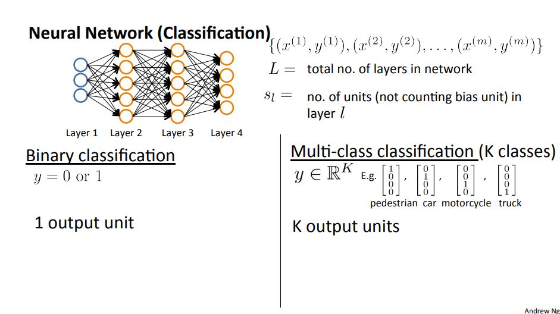

# Machine Learning Week 5

In Week 5 we cover the following topics:
* Neural Networks: Learning

## Neural Networks: Learning

A neural network classification problem could be represented as either a binary or multi-class classification:

	
	<h3>Figure 5-1. Neural network binary and multi-class classification</h3>

The cost function for a neural network could be represented as:

  
  <h3>Figure 5-2. Neural network cost function</h3>

Which turns out to be quite similar to the logistic regression cost function.

The gradient computation takes in the same idea as before: we seek to minimize the cost function. Figure 5-3 depicts the general equation needed to compute the gradient descent of a neural network and minimize the cost function:

  
  <h3>Figure 5-3. Gradient descent for a neural network</h3>

Backpropagation is at the core of how neural networks learn.

To include [backpropagation](https://brilliant.org/wiki/backpropagation/) we would first need to have our neural network defined and an [error function](https://brilliant.org/wiki/artificial-neural-network/#training-the-model). In backpropagation, the final weights are calculated first and the first weights are calculated last. This allows for the efficient computation of the gradient at each layer.

In general, we forward propagate to get the output and compare it with the real value to get the error. Then, we backpropagate to minimize the error (find the derivative of error with respect to each weight then subtract this value from the weight value). This process repeats and continues until we reach a minima for error value.

To summarize on how to train a neural network:

  
  <h3>Figure 5-4. Training a neural network</h3>

In addition to the steps proposed in Figure 5-4:
* Use gradient checking to compare the partial derivative of the cost function with respect to the weights computed using backpropagation versus using numerical estimate of gradient of the cost function
* Disable the gradient checking code
* Use gradient descent or advanced optimization method with backpropagation to try to minimize the cost function as a function of the weights
