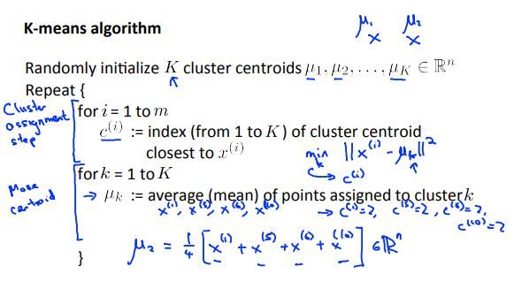
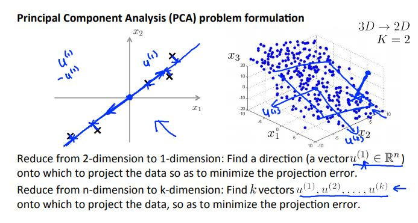

# Machine Learning Week 8

In Week 8 we cover the following topics:
* Unsupervised Learning
* Dimensionality Reduction

## Unsupervised Learning

Unsupervised learning is a machine learning technique for finding hidden patterns or intrinsic structures in data. In other words, unsupervised learning is used to draw inferences from datasets consisting of input data without labeled responses.

The most common unsupervised learning method is cluster analysis, which is used for exploratory data analysis to find hidden patterns or grouping in data. The clusters are modeled using a measure of similarity which is defined upon metrics such as Euclidean or probabilistic distance.

Some applications of clustering include:
* Market segmentation
* Social network analysis
* Organize computing clusters
* Astronomical data analysis

The K-means algorithm is one of the algorithms used for clustering. K is the number of clusters and the training set can me any number from 1 to m training sets. The steps to the K-means algorithm is highlighted in Figure 8-1.

  
  <h3>Figure 8-1. K-means algorithm set-up</h3>

What the algorithm does in Figure 8-1 is effectively partitioning data into k distinct clusters based on distance to the centroid of a cluster. For an animation of how the K-means algorithm works with each iteration see [this page for the standard K-means clustering algorithm](https://en.wikipedia.org/wiki/K-means_clustering)

The K-means algorithm generally uses the random partition method to initialize the algorithm. This means that a cluster is randomly assigned to each observation and then proceeds to update step and compute the initial mean to be the centroid of the cluster's randomly assigned points.

There are many ways to choose the value of K, here are a couple:
* Elbow method - looking for the "drop" in the cost function as the K (number of clusters) increases.
* Downstream method - evaluating K-means based on a metric for how well it performs for that later purpose.

## Dimensionality Reduction

Dimensionality reduction is in the process of reducing the number of random variables under consideration by obtaining a set of principal variables. Dimensionality reduction can be divided into [feature selection and feature extraction](https://en.wikipedia.org/wiki/Dimensionality_reduction).

The main linear technique for dimensionality reduction is principal component analysis (PCA). PCA performs a linear mapping of the data to a lower-dimension space in such a way that the variance of the data in the low-dimensional representation is maximized.

  
  <h3>Figure 8-2. Principal Component Analysis (PCA) Formulation</h3>

Why should we use PCA?
* Compression:
  * Reduce memory/disk needed to store data
  * Speed up learning algorithm
* Visualization of data

When should we use PCA?
* We should use PCA if the raw data x(i) does not do what is intended, then implement PCA and consider using z(i) which is the mapped dataset.

However, what we don't want to do is end up using z(i) to reduce the number of features to k < n to prevent overfitting. Overfitting should be addressed by using regularization.

The recommended approach is to design the ML system first and run the program without using PCA.
