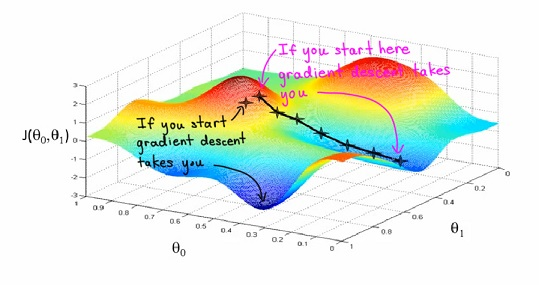

# Machine Learning Week 1

In Week 1 we cover the following topics:
* Linear Regression with One Variable
* Linear Algebra (Review)

## Introduction 

Machine Learning
* Grew out of work in AI
* New capability for computers

Examples:
* Database mining: Large datasets from growth of automation/web. E.g., Web click data, medical records, biology, engineering
* Applications can’t program by hand: E.g., Autonomous helicopter, handwriting recognition, most of Natural Language Processing (NLP), Computer Vision.
* Self-customizing programs: E.g., Amazon, Netflix product recommendations

What is machine learning?
* Arthur Samuel (1959). Machine Learning: *"Field of
study that gives computers the ability to learn
without being explicitly programmed."*

*Tom Mitchell (1998) Well-posed Learning
Problem: *"A computer program is said to learn
from experience E with respect to some task T
and some performance measure P, if its
performance on T, as measured by P, improves
with experience E."*

Two main types of machine learning algorithms:
* Supervised learning: The majority of practical machine learning problems. We know the correct answers, the algorithm iteratively makes predictions on the training data and is corrected. Learning stops when the algorithm achieves an acceptable level of performance. We can group supervised learning problems into:
	* Regression problems: When the output variable is a real value e.g., "dollars" or "weight".
	* Classification problems: When the output variable is a category e.g., "black" or "white".

* Unsupervised learning: When there exists input data and no corresponding output variables. The goal for unsupervised learning is to model the underlying structure or distribution in the data in order to learn more about the data. We can group unsupervised learning problems into:
	* Clustering problems: When we want to discover the inherent groupings in the data e.g., grouping customers by purchasing behavior.
	* Association problems: When we want to discover rules that describe large portions of our data e.g., people that buy X also tend to buy Y.

## Linear Regression with One Variable

In a linear regression problem we predict a real-valued output using existing data that is the "right answer" for each example in the data. Furthermore, we can represent the data with a hypothesis function and use a cost function (squared error function) to minimize the parameters of the hypothesis.

A way of minimizing the cost function is to use the gradient descent method. Gradient descent is an optimization algorithm used to find the values of parameters (coefficients) of a function (f) that minimizes a cost function (cost).

## Linear Algebra (Review)

Matrices and vectors
* Dimensions of matrix: rows x columns

