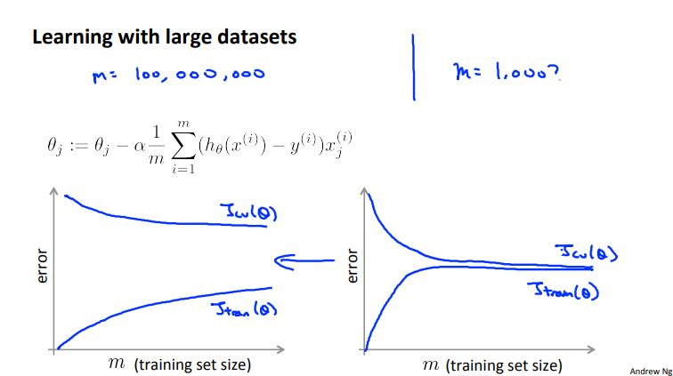
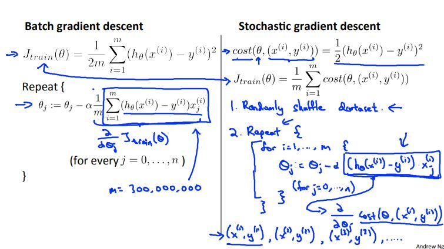
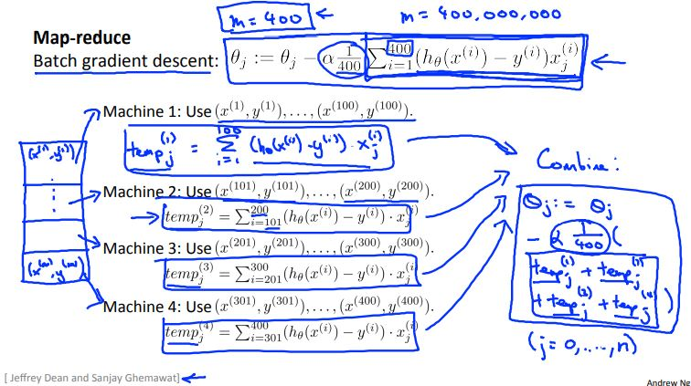

# Machine Learning Week 10

In Week 10 we cover the following topics:
* Large Scale Machine Learning

## Learning with Large Datasets

Often, it has been said in machine learning that: *It's not who has the best algorithm that wins. It's who has the most data.*

Below is a figure which depicts improvements made to our model based on a large dataset

  
  <h3>Figure 10-1. Decrease in error with increased sample size</h3>

## Stochastic Gradient Descent

Stochastic gradient descent (SGD), also known as incremental gradient descent, is an iterative method for optimizing a differentiable objective function, a stochastic approximation of gradient descent optimization.

When the training set is enormous and no simple formulas exist, evaluating the sums of gradients becomes very expensive, because evaluating the gradient requires evaluating all the summand functions' gradients. To economize on the computational cost at every iteration, stochastic gradient descent samples a subset of summand functions at every step. This is very effective in the case of large-scale machine learning problems.

Here are some things to note about SGD:
* In SGD, before for-looping, you need to randomly shuffle the training examples.
* In SGD, because it’s using only one example at a time, its path to the minima is noisier (more random) than that of the batch gradient. But it’s ok as we are indifferent to the path, as long as it gives us the minimum AND the shorter training time.
* Mini-batch gradient descent uses n data points (instead of 1 sample in SGD) at each iteration.

Figure 10-2 shows an example showing the set-up of both a batch gradient descent and SGD.

  
  <h3>Figure 10-2. Batch gradient descent vs SGD</h3>

## Mini-batch Gradient Descent

* Batch gradient descent: Use all *m* examples in each iteration.
* Stochastic gradient descent: Use 1 example in each iteration.
* Mini-batch gradient descent: Use *b* examples in each iteration.

## Stochastic Gradient Descent Convergence

Like previous algorithms we need to check for convergence. Figure 10-3 depicts how we would do that for batch gradient descent and SGD.

  
  <h3>Figure 10-3. Checking for convergence: batch gradient descent vs SGD</h3>

## Map-reduce and data parallelism

Some machine learning algorithms are too big to run on just one machine. We can solve this limitation by using the map-reduce technique.

Figure 10-4 shows how we might implement map-reduce for a batch gradient descent problem.

  
  <h3>Figure 10-4. Map-reduce set-up for batch gradient descent</h3>

After each temp variables have been calculated, a "master server" will combine results of all temp variables to produce the final result.

Many learning algorithms can be expressed as computing sumbs of functions over the training set.

Figure 10-5 shows an example of what map-reduce would look like on a multi-core machine.

  
  <h3>Figure 10-5. Map-reduce on a multi-core machine</h3>

