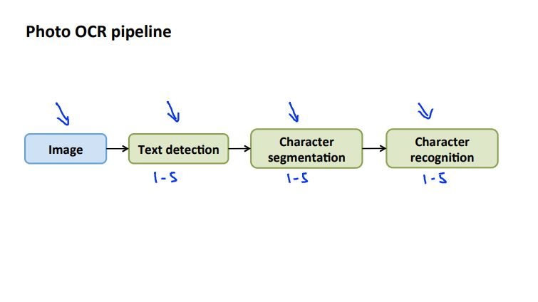
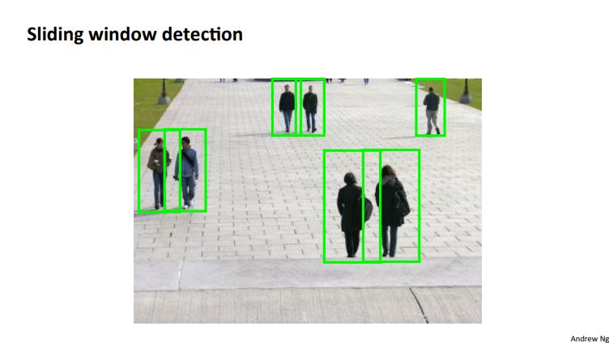
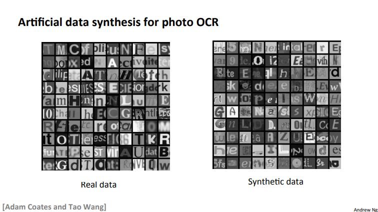

# Machine Learning Week 11

In Week 11 we cover the following topics:
* Photo OCR

## Problem Statement and Pipeline

Below is the wiki definition of optical character recognition:

*Optical character recognition (also optical character reader, OCR) is the mechanical or electronic conversion of images of typed, handwritten or printed text into machine-encoded text, whether from a scanned document, a photo of a document, a scene-photo (for example the text on signs and billboards in a landscape photo) or from subtitle text superimposed on an image (for example from a television broadcast).*

*Widely used as a form of information entry from printed paper data records — whether passport documents, invoices, bank statements, computerized receipts, business cards, mail, printouts of static-data, or any suitable documentation — it is a common method of digitizing printed texts so that they can be electronically edited, searched, stored more compactly, displayed on-line, and used in machine processes such as cognitive computing, machine translation, (extracted) text-to-speech, key data and text mining. OCR is a field of research in pattern recognition, artificial intelligence and computer vision.*

Figure 11-1 depicts the photo OCR pipeline - steps the computer takes to recognize characters - for a typical photo OCR problem.

  
  <h3>Figure 11-1. Photo OCR pipeline</h3>

## Sliding Windows

A sliding windows classifier utilizes aspect ratios (height to width ratios) of certain objects in images to determine whether or not a certain object in a particular image is of interest.

A large training set of positive and negative examples is required in order for the sliding windows technique to work.

Step size (typically 1 pixel) is specified for the algorithm of choice and the algorithm will run through the image 1 pixel at a time to try and detect the object of interest.

Resizing the aspect ratio of the box which is used to detect objects is often a step that happens in order to find objects at different locations in the image. Figure 11-2 depicts the results of using aspect ratios and resizing to detect pedestrians.

  
  <h3>Figure 11-2. Sliding window detection for pedestrians</h3>

After text has been detected character segmentation determines whether or not a line can run through a particular image patch. A supervised learning algorithm can then be applied to classify what character is in an image patch.

## Artificial Data Synthesis

Synthesizing data allows the computer to determine the character even if it may look somewhat different (see Figure 11-3).

  
  <h3>Figure 11-3. Artificial data synthesis for photo OCR</h3>

We can synthesize data by introducing distortions to our training set. However, we do have to be mindful when getting more data:
* Make sure we have low bias classifier before expending the effort (plot learning curves). We can increase the number of features/number of hidden units in our neural network until we have a low bias classifier.
* We have to ask ourselves *"How much work would it be to get ten times as much data as we currently have?"*

## Ceiling Analysis

We have to keep in mind the errors due to each component (ceiling analysis) when working on our solution. By determining the error due to each component we can focus on areas which may require more work than others (improving component x might only yield 1% more accuracy but improving component y might yield 10% more accuracy).
