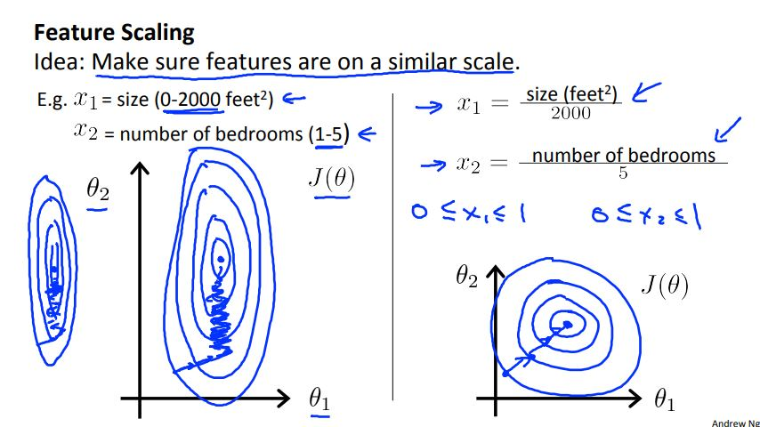

# Machine Learning Week 2

In Week 2 we cover the following topics:
* Linear Regression with Multiple Variables
* Octave/Matlab Tutorial

## Linear Regression with Multiple Variables

Linear regression with multiple variables is not too different than linear regression for single variables. When dealing with multiple variables, we must change the hypothesis, cost function, and gradient descent algorithm to represent multiple features. One way to do this is by using vector notation. An example of linear regression with multiple variables setup is denoted in Figure 2-1.

	
	<h3>Figure 2-1. Linear regression with multiple variables setup</h3>

Feature scaling: make sure features are on a similar scale. One technique used to accomplish this is by using [mean normalization](https://en.wikipedia.org/wiki/Normalization_(statistics)). Feature scaling could drastically change the appearance of a graph and therefore, drastically improve the precision accuracy of a model (see Figure 2-2 for impacts of feature scaling).

	
	<h3>Figure 2-1. Unscaled results versus scaled results</h3>

Learning rate: Specified step-size the algorithm (in this case the gradient descent algorithm) takes at each iteration when trying to minimize the cost function.

In general, if the learning rate:
* Is too small, the convergence could be expected to happen slower than normal
* Is too large, the cost function may not decrease on every iteration and may not converge

Other regression techniques:
* Polynomial regression: Differs from linear regression with the addition of an nth degree term. 
* Normal equation: Method to solve for the function parameters (commonly denoted by theta) analytically.

	
	<h3>Figure 2-3. Gradient descent versus normal equation</h3>

