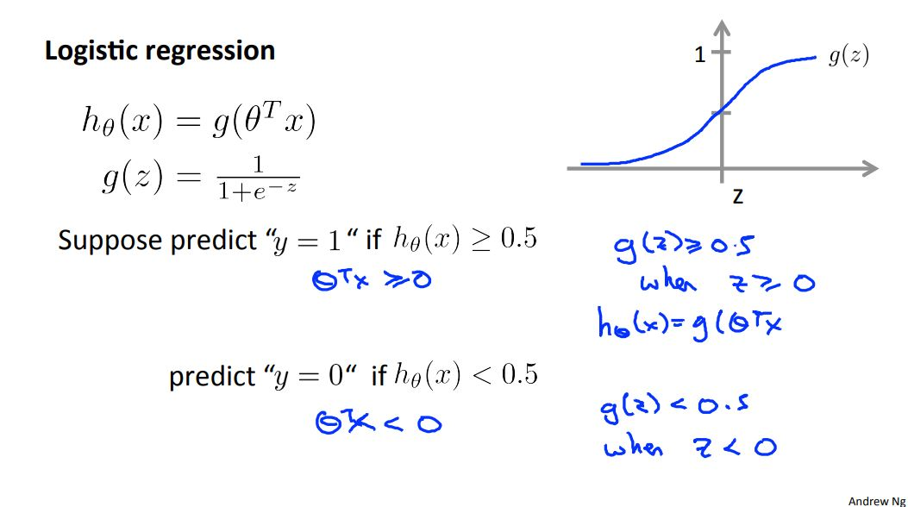
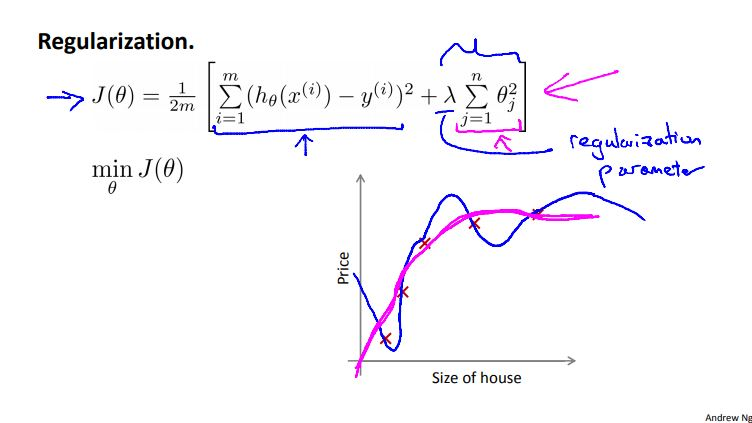

# Machine Learning Week 3

In Week 3 we cover the following topics:
* Logistic Regression
* Regularization

## Logistic Regression

Logistic regression is intended for binary (two-class) classification problems. It will predict the probability of an instance belonging to the default class, which can be snapped into a 0 or 1 classification. 

A logistic regression model could be represented as follows:

	
	<h3>Figure 3-1. Logistic regression model</h3>

We can use a decision boundary to make predictions:

	
	<h3>Figure 3-2. Logistic regression decision boundary setup</h3>

Additionally, the cost function and gradient descent algorithm for logistic regression looks fairly similar to that of linear regression:

	
	<h3>Figure 3-3. Logistic regression cost function and gradient descent</h3>

In addition to linear and logistic regression techniques, we can also use optimization algorithms such as conjugate gradient, BFGS, L-BFGS, etc. The advantages of using optimization algorithms is that we do not manually have to pick the step-size variable. Optimization algorithms tend to be faster than gradient descent.

Multi-class classification: When there is more than one class, we can apply the one-vs-all method:

	
	<h3>Figure 3-4. Multi-class classification: one-vs-all method</h3>

## Regularization

Overfitting: If we have too many features, the learned hypothesis may fit the training set very well, but fail to generalize to new examples (predict prices on new examples).

To address overfitting we can do the following:
* Reduce the number of features
	* Manually select which features to keep
	* Model selection algorithm
* Regularization
	* Keep all the features, but reduce magnitude/values of parameters
	* Works well when we have a lot of features, each of which contributes a bit to predicting the output.

The cost function for regularization incudes an extra parameter to the cost function:

	
	<h3>Figure 3-5. Regularization</h3>

We do not want the lambda setting to be too small or else it will result in overfitting. Conversely, we do not want the lambda setting to be too large or else minimization of the cost function will result in underfitting.

The regularization parameter can be added to a linear or a logistic cost function as well as a gradient descent.