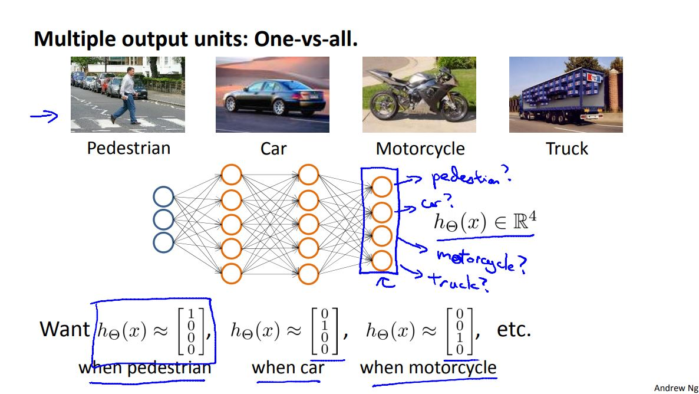

# Machine Learning Week 4

In Week 4 we cover the following topics:
* Neural Networks: Representation

## Neural Networks: Representation

Neural networks originated from algorithms that try to mimic the brain. The use of such algorithms became popular in the 80s and early 90s but soon diminished in the late 90s. Today, neural networks are being used for many applications.

A neural network could be represented as follows:

	
	<h3>Figure 4-1. Neural network model</h3>

Where the activation terms denoted by "a" occur in layer 2 to layer n (hidden layer). Alternatively, neural networks can be [vectorized](http://ufldl.stanford.edu/wiki/index.php/Neural_Network_Vectorization).

When trying to classify more than one output units a representation model could look like this:

	
	<h3>Figure 4-2. Neural network model: one-vs-all</h3>

