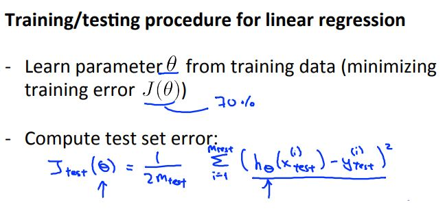
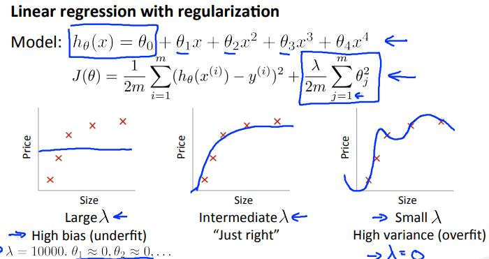
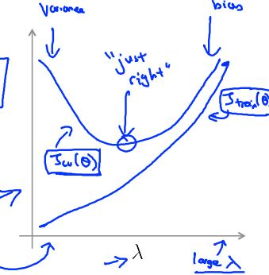

# Machine Learning Week 6

In Week 6 we cover the following topics:
* Advice for Applying Machine Learning

## Advice for Applying Machine Learning

When deciding on what to try next during machine learning algorithm development, there are steps that should be considered.

An example could be if we implemented regularized linear regression to predict housing prices but the hypothesis makes unacceptable large errors in its predictions. In this case we should try to:
* Get more training examples
* Get additional features

A diagnostic is a test you can run to gain insight what is/isn't working with a learning algorithm, and gain guidance as to how best to improve its performance. Although diagnostics can take time to implement, doing so can be a very good use of time.

The training/testing procedure for linear regression is depicted in Figure 6-1.

  
  <h3>Figure 6-1. Training/testing procedure for linear regression</h3>

Likewise, the training/testing procedure for logistic regression is as follows:

  
  <h3>Figure 6-2. Training/testing procedure for logistic regression</h3>

What does it mean when we say our model has bias or variance?
* Bias -> underfit
* Variance -> overfit

Figure 6-3 depicts an example of bias and variance

  
  <h3>Figure 6-3. Example of bias and variance</h3>

There are two types of errors we care about when dealing with bias and variance:
* Training error
* Cross validation error

The training error can be represented as a function whose error decreases with additional polynomial terms. In contrast, the cross validation error can be represented as a parabolic function where there is a specific degree of polynomial terms that would yield a minimum error.

  
  <h3>Figure 6-4. Training error versus cross validation error</h3>

In general, when the learning algorithm has bias:
* Training error will be high
* Cross validation error will be approximately the same as the training error

When the learning algorithm has variance:
* Training error will be low
* The cross validation error will be much greater than the training error

Linear regression with regularization also has bias or variance depending on the value of lambda.

  
  <h3>Figure 6-5. Example of bias and variance for regularized learning algorithms</h3>

Similar to the training error and cross validation error for non-regularized algorithms, regularized algorithms have a parabolic cross validation where a specific value of lambda minimizes the bias/variance. However, the bias increases as the lambda value is increased for the training error.

  
  <h3>Figure 6-6. Training error and cross validation error as a function of the regularization parameter</h3>

If a learning algorithm is suffering from high bias, getting more training data will not (by itself) help much. However, if a learning algorithm is suffering from high variance, getting more training data is likely to help.

Revisiting the "next steps" to debugging an algorithm:
* Getting more training examples -> Fixes high variance
* Try smaller sets of features -> Fixes high variance
* Try getting additional features -> Fixes high bias
* Try adding polynomial features -> Fixes high bias
* Try decreasing lambda -> Fixes high bias
* Try increasing lambda -> Fixes high bias

When it comes to neural networks:
* Smaller neural networks have fewer parameters and are more prone to underfitting but are computationally cheaper
* Larger neural networks have more parameters and are more prone to overfitting (computationally more expensive)

We typically use regularization to address overfitting for neural networks.

## Machine Learning System Design

Suppose we build a spam classifier where x = features of email and y = spam or not spam (1 or 0). In practice, we would take the most frequently occurring n words (10,000 to 50,000) in training set, rather than manually pick 100 words.

What is the best use of time to make it have low error?
* Start with a simple algorithm that you can implement quickly then implement it and test on cross validation data
* Plot learning curves to decide if more data, more features, etc. are likely to help
* Error analysis: manually examine the examples (cross validation set) that your algorithm made errors on then see if you spot any systematic trend in what type of example it is making errors on

For error metrics, we can use a cancer classification example where we have 1% error on test set where only 0.5% of patients have cancer. In this case we introduce precision and recall:
* Precision: Of all patients where we predicted y = 1, what fraction actually has cancer?
* Recall: Of all patients that actually have cancer, what fraction did we correctly detect as having cancer?

There is a trade-off between precision and recall:
* If we wanted to predict y = 1 only when very confident we would have higher precision and lower recall.
* If we wanted to avoid missing too many cases of cancer we would have higher recall and lower precision
* In general we want to predict 1 if the hypothesis output is greater than the threshold

When designing a high accuracy learning system, we want to:
* Have as much data as possible
* Use a learning algorithm with many parameters (e.g. logistic regression/linear regression with many features; neural network with many hidden units)

The cost of training will be small for low bias algorithms and using a very large training set will result in low variance.
