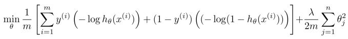

# Machine Learning Week 7

In Week 7 we cover the following topics:
* Support Vector Machines

## Support Vector Machines

Support vector machines are supervised learning models with associated leanring algorithms that analyze data used for classification and regression analysis.

Given a set of training examples, each marked as belonging to one or the other of two categories, an SVM training algorithm builds a model that assigns new examples to one category or the other, making it a non-probabilistic binary linear classifier.

The logistic regression algorithm for support vector machines is depicted in Figure 7-1.

  
  <h3>Figure 7-1. Logistic regression algorithm for support vector machines</h3>

In general, the SVM hypothesis can be written as follows:

  
  <h3>Figure 7-2. Support vector machine hypothesis</h3>

If we look within the brackets of the equation depicted in Figure 7-2, we can extract information on the SVM decision boundary:
* When y(i) = 1, we want the term within the cost function to be greater than or equal to 1
* When y(i) = 0, we want the term within the cost function to be less than or equal to -1

  
  <h3>Figure 7-3. Visual representation of a support vector machine decision boundary</h3>

We can use a SVM as a [large margin classifier](http://www.cs.colostate.edu/~cs545/fall16/lib/exe/fetch.php?media=wiki:07_svm.pdf)
