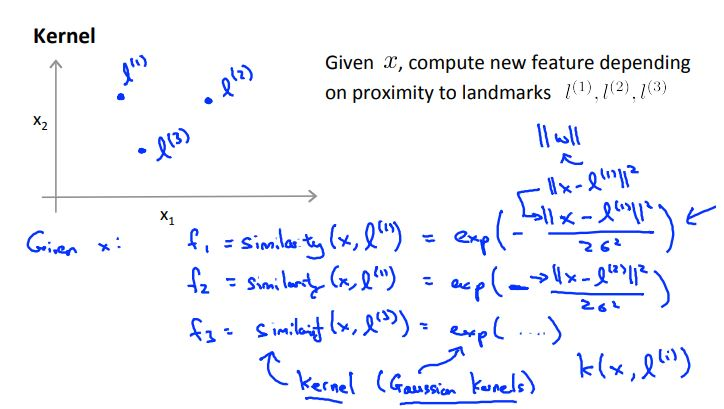

# Machine Learning Week 7

In Week 7 we cover the following topics:
* Support Vector Machines

## Support Vector Machines

Support vector machines (SVMs) are supervised learning models with associated leanring algorithms that analyze data used for classification and regression analysis.

Given a set of training examples, each marked as belonging to one or the other of two categories, an SVM training algorithm builds a model that assigns new examples to one category or the other, making it a non-probabilistic binary linear classifier.

We can start by exploring an alternate logistic regression algorithm depicted in Figure 7-1.

  
  <h3>Figure 7-1. Alternative logistic regression algorithm</h3>

In comparison, the SVM hypothesis can be written as follows:

  
  <h3>Figure 7-2. Support vector machine hypothesis</h3>

If we look within the brackets of the equation depicted in Figure 7-2, we can extract information on the SVM decision boundary:
* When y(i) = 1, we want the term within the cost function to be greater than or equal to 1
* When y(i) = 0, we want the term within the cost function to be less than or equal to -1

  
  <h3>Figure 7-3. Visual representation of a support vector machine decision boundary</h3>

We can use a SVM as a [large margin classifier](http://www.cs.colostate.edu/~cs545/fall16/lib/exe/fetch.php?media=wiki:07_svm.pdf). In large margin classification, a perceptron is a hyperplane that separates classes (see previous link on large margin classifiers for more details).

In machine learning, kernel methods are a class of algorithms for pattern analysis, whose best known member is the SVM. The general task of pattern analysis is to find and study general types of relations (e.g. clusters, rankings, principal components, correlations, classifications) in datasets.

  
  <h3>Figure 7-4. Example of a kernel method</h3>

Similarity kernels works as follows:

* If the given data x is close to the landmarks, then the similarity f will be approximately equal to 1
* If the given data x is far from the landmarks, then the similarity f will be approximately equal to 0

To use kernels with SVMs simply refer to Figure 7-2 and replace the x(i) terms with f(i) similarity term.

SVM parameters are chosen based on the following factors:

  
  <h3>Figure 7-5. Support vector machine parameters and observations</h3>

In practice, we follow several steps to implement SVM in our projects:
* Use SVM software package (e.g. liblinear, libsvm, ...) to solve for the theta parameters
* Specify choice of parameter C and choice of kernel (similarity function):
  * No kernel (linear kernel), where we predict y = 1 if the hypothesis (the term in the cost function in Figure 7-2) is greater than or equal to zero
  * Gaussian kernel (Figure 7-4), where l(i) = x(i)

We must note that for a Gaussian kernel, we should perform feature scaling before using the Gaussian kernel, otherwise our model will not perform as intended. Additionally, not all similarity functions make valid kernels. We need to satisfy a technical condition called [Mercer's Theorem](https://www.quora.com/What-is-an-intuitive-explanation-of-Mercers-Theorem) to make sure SVM packages do not diverge and run as intended.

The table below address the differences between logistic regression vs SVMs:
* n = number of features
* m = number of training examples
* For the case where n is small and m is large, it is recommended to create/add more features first then use logistic regress or SVM without a kernel

Case | Logistic regression | SVMs
--- | --- | ---
n is large| Ok to use | Use linear kernel (SVM without a kernel)
n is small/m is intermediate | Not preferred | Use SVM with Gaussian kernel
n is small/m is large | Ok to use | Use linear kernel (SVM without a kernel)

Additionally, applying neural networks to these problems will most likely work well but may be slower to train.
