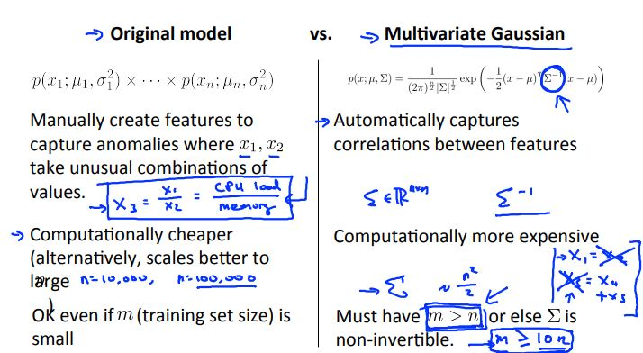

# Machine Learning Week 9

In Week 9 we cover the following topics:
* Anomaly Detection
* Recommender Systems

## Anomaly Detection

Anomaly detection is a technique used to identify unusual patterns that do not conform to expected behavior, called outliers. It has many applications in business, from intrusion detection (identifying strange patterns in network traffic that could signal a hack) to system health monitoring (spotting a malignant tumor in an MRI scan), and from fraud detection in credit card transactions to fault detection in operating environments.

Anomalies can be classified as:

* **Point anomalies**: A single instance of data is anomalous if it's too far off from the rest. Business use case: Detecting credit card fraud based on "amount spent."

* **Contextual anomalies**: The abnormality is context specific. This type of anomaly is common in time-series data. Business use case: Spending $100 on food every day during the holiday season is normal, but may be odd otherwise.

* **Collective anomalies**: A set of data instances collectively helps in detecting anomalies. Business use case: Someone is trying to copy data form a remote machine to a local host unexpectedly, an anomaly that would be flagged as a potential cyber attack.

Figure 9-1 depicts an example of how anomaly detection could be setup.

  
  <h3>Figure 9-1. Fraud detection</h3>

We can use Gaussian distribution to find any outliers in our data. Additionally, we can also use density estimation (the construction of an estimate based on observed data of an unobservable underlying probability density function) to build our anomaly detection algorithm as shown in Figure 9-2.

  
  <h3>Figure 9-2. Anomaly detection algorithm</h3>

When developing a learning algorithm, making decisions is much easier if we have a way of evaluating our learning algorithm.

We can first fit our model to our training set and then on a cross validation test we can evaluate metrics such as:
* True positive, false positive, false, negative, true negative
* Precision/recall
* F-score

The differences between anomaly detection (recall that anomaly detection is an unsupervised learning technique) and supervised learning is shown in Figure 9-3.

  
  <h3>Figure 9-3. Anomaly detection versus supervised learning</h3>

In general, when conduction error analysis on anomaly detection we generally want our predictions to be large for normal examples and small for anomalous examples.

We can also compare the original model for anomaly detection against a multivariate Gaussian distribution model in Figure 9-4.

  
  <h3>Figure 9-4. Original model vs multivariate Gaussian</h3>

## Recommender Systems

A recommender system is a subclass of information filtering system that seeks to predict the "rating" or "preference" a user would give to an item.

Recommender systems have become increasingly popular recent years, and are utilized in a variety of areas including movies, music, news, books, research articles, search queries, social tags, and products in general.

Recommender systems typically produce a list of recommendations in one of two ways – through collaborative filtering or through content-based filtering (also known as the personality-based approach):
* **Collaborative filtering**: approaches build a model from a user's past behavior (items previously purchased or selected and/or numerical ratings given to those items) as well as similar decisions made by other users. This model is then used to predict items (or ratings for items) that the user may have an interest in.
* **Content-based filtering**: approaches utilize a series of discrete characteristics of an item in order to recommend additional items with similar properties.

Figure 9-5 shows what the algorithm could look like for a content-based recommendation.

 

  
  <h3>Figure 9-5. Optimization for content-based recommendation</h3>

Collaborative filtering works differently by minimizing the training set data (x) and the parameters (theta) simultaneously. Figure 9-6 shows how one could setup the algorithm for such a problem.

 

  
  <h3>Figure 9-6. Collaborative filtering algorithm</h3>

Recommender systems can also be implemented in vectorized notation as well using techniques such as low rank matrix factorization and mean normalization
